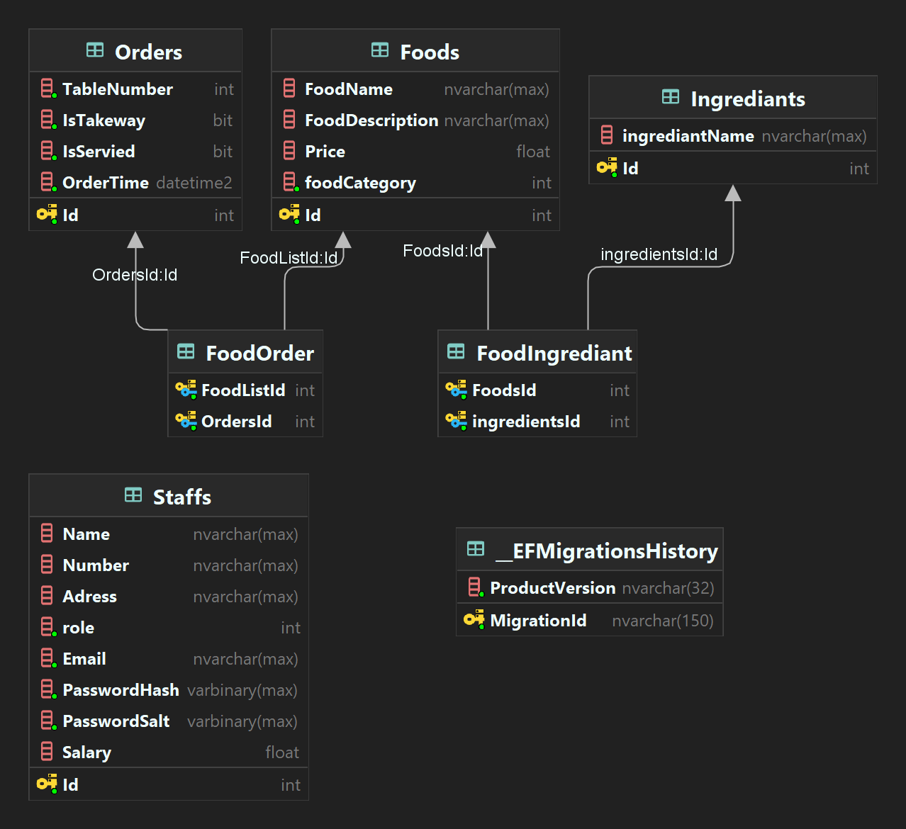

# Resto-End-Point
*************************************************
## => Resto-End-Points is a RESTful API for Restaurant managment.
### Resto an online system for managing Restaurant including manage Orders, Stuff, and Food.
*************************************************
*************************************************
# DB Schema: 

*************************************************

*************************************************

# Contains the following endpoints:

## All Endpoints are protected by JWT Authentication.

*************************************************
## 1. Food Endpoints:
### 1.1. Get all Food:
#### GET /food
### 1.2. Get Food by ID:
#### GET /food/{id}
### 1.3. Add Food:
#### POST /food
### 1.4. Update Food:
#### PUT /food/{id}
### 1.5. Delete Food:
#### DELETE /food/{id}
*************************************************
## 2. Order Endpoints:
### 2.1. Get all Orders:
#### GET /order
### 2.2. Get Order by ID:
#### GET /order/{id}
### 2.3. Add Order:
#### POST /order
### 2.4. Update Order:
#### PUT /order/{id}
### 2.5. Delete Order:
#### DELETE /order/{id}
*************************************************
## 3. Stuff Endpoints:
### 3.1. Get all Stuff:
#### GET /stuff
### 3.2. Get Stuff by ID:
#### GET /stuff/{id}
### 3.3. Add Stuff:
#### POST /stuff
### 3.4. Update Stuff:
#### PUT /stuff/{id}
### 3.5. Delete Stuff:
#### DELETE /stuff/{id}
*************************************************
## 4. Ingredient Endpoints:
### 4.1. Get all Ingredients:
#### GET /ingredient
### 4.2. Get Ingredient by ID:
#### GET /ingredient/{id}
### 4.3. Add Ingredient:
#### POST /ingredient
### 4.4. Update Ingredient:
#### PUT /ingredient/{id}
### 4.5. Delete Ingredient:
#### DELETE /ingredient/{id}
*************************************************
